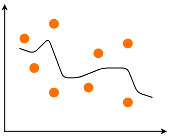
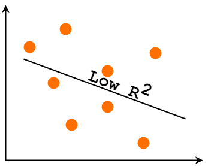

# Overfitting and Underfitting

## Overfitting 

The model has an excessive capacity and it's not more able to generalize considering the original dynamics provided by the training set. It can associate almost perfectly all the known samples to the corresponding output values, but when an unknown input is presented, the corresponding prediction error can be very high. 

## Underfitting

It means that the model isn't able to capture the dynamics shown by the same training set \(probably because its capacity is too limited\).

