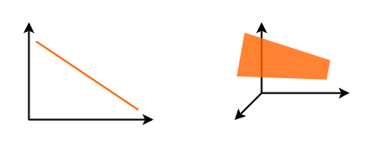

# Linear Regression

Linear regression is used for finding linear relationship between target and one or more predictors. 


The core idea is to obtain a line that best fits the data. The best fit line is the one for which total prediction error are as small as possible. Error is the distance between the point to the regression line.


There are two types of linear regression- **Simple** and **Multiple**.

Making Prediction is all about forecasting given and existing set of data.

